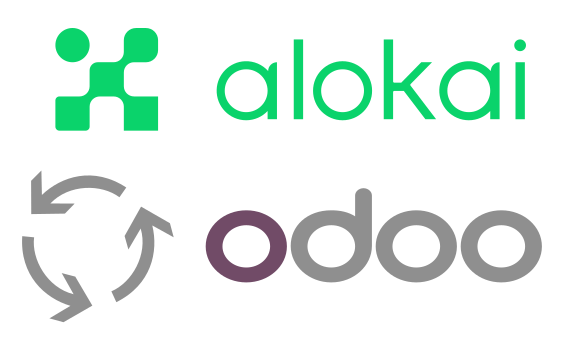

<div align="center">
  
</div>

### Stay connected

[](https://github.com/vuestorefront/vue-storefront)
[](https://twitter.com/vuestorefront)
[](https://www.youtube.com/c/VueStorefront)
[](https://discord.vuestorefront.io)

## Alokai SDK integration with Odoo

This project is a Odoo integration with [Alokai](https://github.com/vuestorefront-community/vue-storefront/).
This integration is being developed and maintained by [ERPGAP / PROMPTEQUATION](https://www.erpgap.com/) ❤️

Check our [demo](https://vsfsdk.labs.odoogap.com/) server (it's a dev server so could be down sometimes)

## How to start?

```sh
1. git clone https://github.com/vuestorefront-community/odoo
2. git submodule init
3. git submodule update # now you fetched the theme submodule from template-odoo
2. yarn install
3. yarn build # (optional) Verify if everything works properly by building all three projects
4. yarn dev
5. If you want to use your own Odoo server you will need to add the [odoo-addons](https://github.com/erpgap/alokai-odoo) repository to your server
```

Want to contribute? Ping us on `odoo` channel on [our Discord](https://discord.vuestorefront.io) or email us at info (at) odoogap.com!

## Directory structure

* **packages/api-client** - communicates with a backend;
* **packages/composables** - exposes composable functions used to retrieve data using `api-client` and to map them to universal data formats using `getters`;
* **packages/theme** - `nuxt` project that glues everything together. It extends our core theme and uses `composables` to retrieve data.

## Resources

* [Vue Storefront Documentation](https://docs.vuestorefront.io/v2/)
* [Odoo integration Documentation](https://docs.alokai.com/integrations/odoo)
* [Odoo Backend Modules](https://github.com/erpgap/alokai-odoo)

## Support

If you have any questions about this integration we will be happy to answer them on `odoo` channel on [our Discord](discord.vuestorefront.io).

## Credits

### Authors

* ERPGAP / PROMPTEQUATION

### Dependency Odoo Modules

* [OCA - Odoo Community Association - Base REST](https://github.com/OCA/rest-framework)

## Contributors ✨

<!-- ALL-CONTRIBUTORS-LIST:START - Do not remove or modify this section -->
<!-- prettier-ignore-start -->
<!-- markdownlint-disable -->
<table>
  <tr>
    <td align="center"><a href="http://www.erpgap.com/"><br /><sub><b>LMuniz</b></sub></a><br />
    <a href="https://github.com/vuestorefront-community/odoo/commits?author=LeoMunizOdoo " title="Code">💻</a></td>
    <td align="center"><a href="http://www.erpgap.com/"><br /><sub><b>cpintofonseca</b></sub></a><br />    <a href="https://github.com/vuestorefront-community/odoo/commits?author=cpintofonseca" title="Code">💻</a></td>
    <td align="center"><a href="https://github.com/SDMonteiro"><br /><sub><b>SDMonteiro</b></sub></a><br /><a href="https://github.com/vuestorefront-community/odoo/commits?author=SDMonteiro" title="Code">💻</a></td>
    <td align="center"><a href="https://github.com/brunoodoogap"><br /><sub><b>brunoodoogap</b></sub></a><br /><a href="https://github.com/vuestorefront-community/odoo/commits?author=brunoodoogap" title="Code">💻</a></td>
    <td align="center"><a href="https://github.com/dduarte-odoogap"><br /><sub><b>Diogo Duarte</b></sub></a><br /><a href="https://github.com/vuestorefront-community/odoo/commits?author=dduarte-odoogap" title="Code">💻</a></td>
  </tr>
</table>

<!-- markdownlint-restore -->
<!-- prettier-ignore-end -->

<!-- ALL-CONTRIBUTORS-LIST:END -->

This project follows the [all-contributors](https://github.com/all-contributors/all-contributors) specification. Contributions of any kind welcome!
